.. _cgipes:

CGIPES
======

Os CGIPES (*Comitês de Acompanhamento de Egressos*) são gerenciados em cada *Campi* por usuários do SIGAA com
perfil de GESTOR_EGRESSOS.

O módulo Portal do Egresso pode ser acessado clicando no respectivo botão de acesso no SIGAA (após fazer login),
conforme mostra a figura a seguir:

.. image:: _static/img/menu.png

Gerenciar CGIPES
----------------

Para acessar a página de gerenciamento de CGIPES, basta passar o mouse sobre o menu *CGIPES* e selecionar o sub-menu
*Gerenciar CGIPES* como mostra a imagem a seguir:

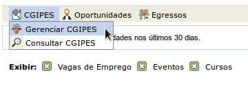

Em seguida o sistema carrega uma página contendo a listagem de todos os CGIPES cadastrados, junto com os botões de controle
*Cadastrar*, *Gerenciar membros*, *Alterar* e *Remover CGIPES*:

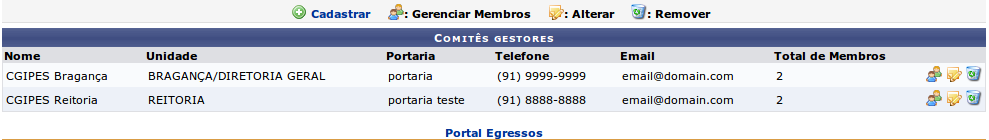

.. _cadastrar_novo_cgipes:

Cadastrar Novo CGIPES
~~~~~~~~~~~~~~~~~~~~~

Ao clicar no link *Cadastrar*, o sistema carrega o formulário de criação de novo CGIPES.

.. image:: _static/img/cadastrar.png

Todos os campos são requeridos e auto-explicativos. Após preencher todos os campos corretamente, o usuário clica
no botão *cadastrar* para criar um novo
CGIPES. Se o registro for inserido corretamente, o sistema redireciona para a página contendo a listagem de todos os CGIPES e 
ações.

Também é possível clicar no botão *voltar*, para retornar para a página de listagem, ou *cancelar*, para
retornar a página inicial do portal do egresso. Lembrando que quaisquer dados não salvos são perdidos caso os botões
*voltar* e *cancelar* sejam clicados (o botão cancelar exibe uma mensagem de notificação antes de retornar para
página inicial do portal do egresso).

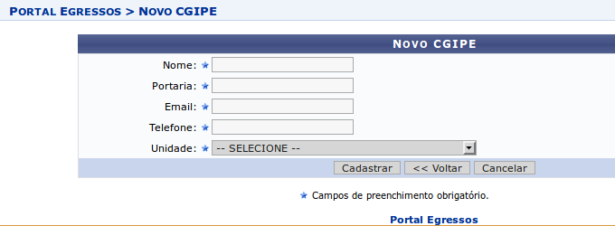

Editar CGIPES
~~~~~~~~~~~~~

Para iniciar o processo de edição, o usuário deve clicar no botão *alterar* do respectivo CGIPES que deve ser editado.

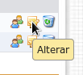

Após o CGIPES ser selecionado, o sistema carrega a página contendo o formulário de novo CGIPES com os campos
preenchidos. O usuário altera os dados a seu critério e em seguida clicar no botão *Atualizar*. Se os campos
estivem com os formatos corretos, o sistema atualiza o CGIPES e redireciona para a página contendo a listagem de todos os CGIPES e ações.
Os botões *voltar* e *cancelar* funcionam de forma idêntica ao do formulário da seção `Cadastrar Novo CGIPES`_.

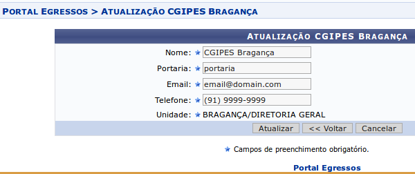

Remover CGIPES
~~~~~~~~~~~~~~

Para remover um CGIPES, deve-se clicar no botão *Remover* do respectivo CGIPES na página de listagem. Uma mensagem de confirmação é exibida ao usuário
antes do sistema efetivamente remover o CGIPES. Um CGIPES não pode ser removido se possuir membros vinculados.

.. image:: _static/img/cgipes/remover.png

Gerenciamento de Membros do CGIPES
~~~~~~~~~~~~~~~~~~~~~~~~~~~~~~~~~~

Para acessar a página de gerenciamento de membros, basta clicar no botão *Gerenciar Membros* do respectivo CGIPES.

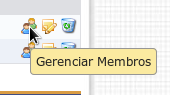

A página consiste em duas seções, uma contendo o formulário de inclusão de um novo Membro para um determinado CGIPES
e outra, abaixo, contendo a listagem de membros para aquele CGIPES:

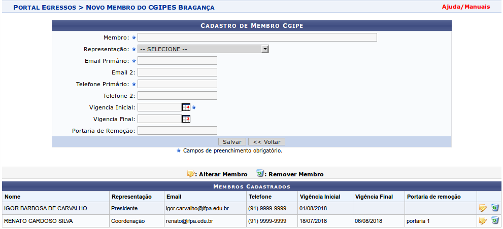

.. _cadastro_novo_membro_cgipes:

Cadastro de Novo Membro do CGIPES
*********************************

Todos os campos marcados com ``*`` são obrigatórios. O campo *Membro* é do tipo *autocompletar*. O usuário digita
alguns caracteres (pelo menos 3) e o sistema busca por registros cujo nome corresponda a texto inserido. Em seguida o usuário
clica em um dos registros apresentados na lista de resultados para selecioná-lo.

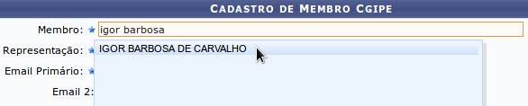

Os campos de *vigência* são do tipo *data*. O usuário clica no ícone do calendário ao lado direito do campo e
um pequeno calendário é exibido na tela. Em seguida é possível usar os controles desse calendário para selecionar mês e ano,
e finalmente clicar no dia do mês para selecioná-lo. É possível digitar uma data diretamente no campo de texto sem
precisar do calendário (nesse caso os caracteres ``/`` que formam a data são incluídos automaticamente).

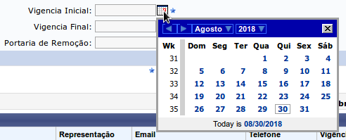

O campo *Vigência Final* não é requerido, mas um membro só poderá ser atualizado caso seja informado o campo
*Portaria de Remoção* **em conjunto** com o campo *Vigência Final*. Isso ocorre devido a data final de vigência
de um membro estar acompanhada de uma portaria específica. Portanto, também não é possível incluir um membro com o campo
*Portaria de Remoção* preenchido se o campo *Vigência Final* estiver vazio.

**Um membro não pode fazer parte de mais de um CGIPES ao mesmo tempo**. Caso o usuário tente inserir um novo membro já pertencente
a outro CGIPES, o sistema impede o cadastro e exibe uma mensagem de erro na tela.

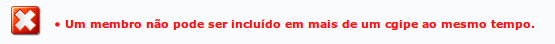

Ao clicar no botão *Voltar*, o sistema redireciona para a página de listagem de CGIPES.

Após a inserção dos dados corretamente, o usuário clica no botão *Salvar* e um novo membro é incluído na listagem
de membros daquele CGIPES.

Editar Membro do CGIPES
***********************

Para editar um membro, o usuário clica no botão *Alterar Membro*, do respectivo membro que se quer editar, a partir
da seção que contém a listagem de membros para aquele CGIPES.

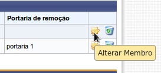

O sistema então carrega o formulário de cadastro preenchido com os dados do membro que acabou
de ser selecionado. O usuário então pode editar os campos do formulário seguindo as mesmas recomendações descritas na seção
`Cadastro de Novo Membro do CGIPES`_. Após alterar os dados do membro, o usuário clica no botão *Atualizar*. Se os dados inseridos
estiverem com os formatos corretos, o sistema atualiza o membro e atualiza a listagem de membros daquele CGIPES (agora
contendo os dados atualizados do membro que acabou de ser editado).

Remover Membro do CGIPES
************************

Para remover um membro, o usuário clica no botão *Remover Membro* do respectivo membro que se quer remover, a
partir da listagem de membros.

.. image:: _static/img/cgipes/remover_membro.png

O sistema exibe uma mensagem de confirmação antes de desligar o membro daquele CGIPES. Após ser removido, um
membro pode ser incluído em outro CGIPES, se for o caso.

Visualizar CGIPES
-----------------

Os CGIPES cadastrados podem ser visualizados em dois locais específicos. O primeiro local é a partir do portal
do egresso, bastando o usuário passar o mouse sobre o menu CGIPES e selecionar o submenu *Consultar CGIPES*
como mostra a imagem a seguir:

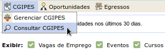

Por padrão o sistema carrega o CGIPES referente a unidade do usuário logado no SIGAA, selecionando automaticamente
a unidade do usuário no filtro *Parâmetros de Busca* (veja a imagem a seguir). Caso não haja um CGIPES relacionado com
a unidade do usuário, o sistema deixa em branco o filtro *Parâmetros de Busca*, o que efetivamente carrega
a lista de todos os CGIPES cadastrados:

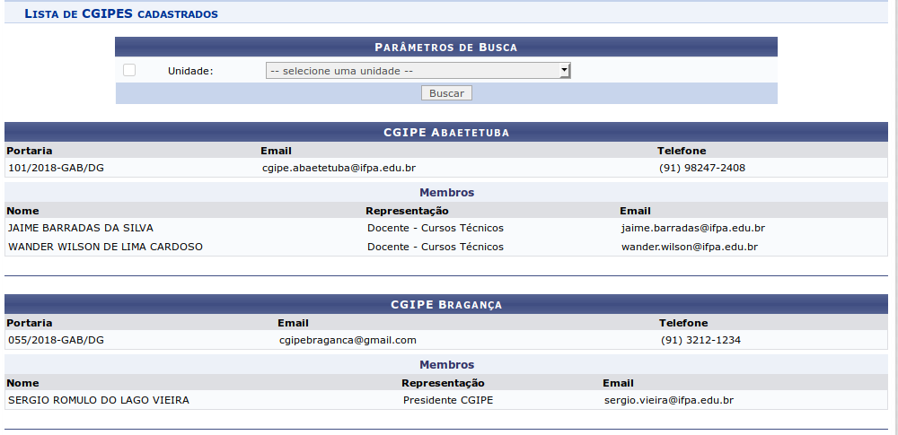

A listagem dos CGIPES cadastrados também está disponível na
`área pública do SIGAA <https://sigaa.ifpa.edu.br/sigaa/public/>`_. Para acessar a lista de CGIPES cadastrados,
o usuário deverá clicar na aba lateral *Egressos* e em seguida no *banner* *CGIPES*, como mostra a imagem a seguir:

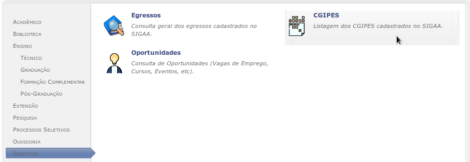

A listagem de CGIPES na `área pública do SIGAA <https://sigaa.ifpa.edu.br/sigaa/public/>`_ funciona de forma
idêntica a listagem disponível no portal do egresso (descrita anteriormente).

.. raw:: latex

    \newpage
