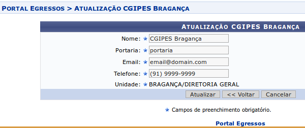

1. CGIPES
=========

Os CGIPES (*Comitês de Acompanhamento de Egressos*) são cadastrados em cada *Campi* por usuários do SIGAA com
perfil de GESTOR_EGRESSOS.

O módulo Portal do Egresso pode ser acessado clicando no respectivo botão de acesso no SIGAA (após fazer login),
conforme mostra a figura a seguir:

.. figure:: _static/img/menu.png

1.2. Gerenciar CGIPES
---------------------

Para acessar a página de gerenciamento de CGIPES, basta passar o mouse sobre o menu *CGIPES* e selecionar o sub-menu
*Gerenciar CGIPES* como mostra a imagem a seguir:

.. figure:: _static/img/gerenciar_cgipes.png

Em seguida o sistema carrega uma página contendo a listagem de todos os CGIPES cadastrados, junto com as opções para
*Cadastrar*, *Gerenciar membros*, *Alterar* e *Remover CGIPES*:

.. figure:: _static/img/comites.png

1.2.1. Cadastrar Novo CGIPES
~~~~~~~~~~~~~~~~~~~~~~~~~~~~

Ao clicar no link *Cadastrar*, o sistema carrega o formulário de criação de novo CGIPES.

.. figure:: _static/img/cadastrar.png

Todos os campos são requeridos e auto-explicativos. Após preencher todos os campos corretamente, o usuário clica
no botão *cadastrar* para criar um novo
CGIPES. Se o registro for inserido corretamente, o sistema redireciona para a página contendo a listagem de todos os CGIPES e 
ações. Também é possível clicar no botão *voltar*, para retornar para a página de listagem, ou *cancelar*, para
retornar a página inicial do portal do egresso. Lembrando que quaisquer dados não salvos são perdidos caso os botões
*voltar* e *cancelar* sejam clicados (o botão cancelar exibe uma mensagem de notificação antes de retornar para
página inicial do portal do egresso).

.. figure:: _static/img/form_novo_cgipes.png

1.2.2. Editar CGIPES
~~~~~~~~~~~~~~~~~~~~

Para iniciar o processo de edição, o usuário deve clicar no botão *alterar* do respectivo CGIPES que deve ser editado.

.. figure:: _static/img/alterar.png

Após o CGIPES ser selecionado, o sistema carrega a página contendo o formulário de novo CGIPES com os campos
preenchidos. O usuário altera os dados a seu critério e em seguida clicar no botão *atualizar*. Se o registro
for inserido corretamente, o sistema redireciona para a página contendo a listagem de todos os CGIPES e ações.
Os botões *voltar* e *cancelar* funcionam de forma idêntica ao do formulário de criação de novo CGIPES (seção 1.2.1.).

1.2.3. Deletar CGIPES
~~~~~~~~~~~~~~~~~~~~~

Para deletar um CGIPES, deve-se clicar no botão *remover* do respectivo CGIPES na página de listagem. Uma mensagem de confirmação é exibida ao usuário
antes do sistema efetivamente apagar o CGIPES. Um CGIPES não pode ser removido se possuir membros vinculados.

.. figure:: _static/img/remover.png

1.2.4. Gerencimento de Membros
~~~~~~~~~~~~~~~~~~~~~~~~~~~~~~
