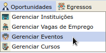
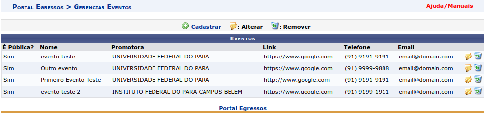
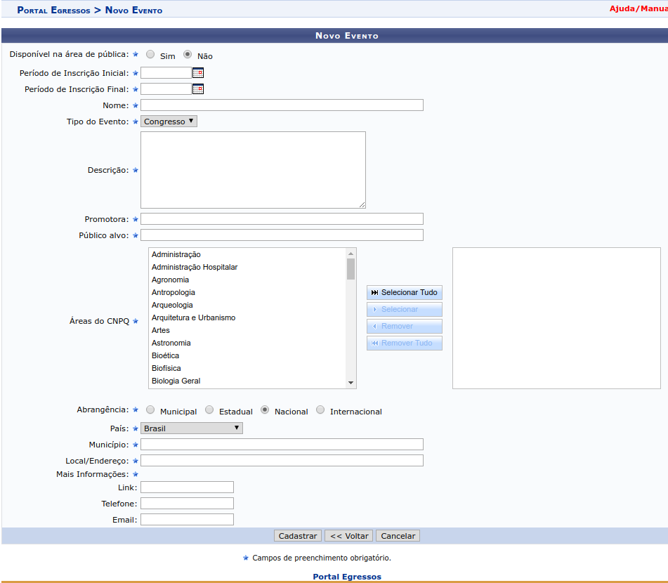
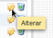
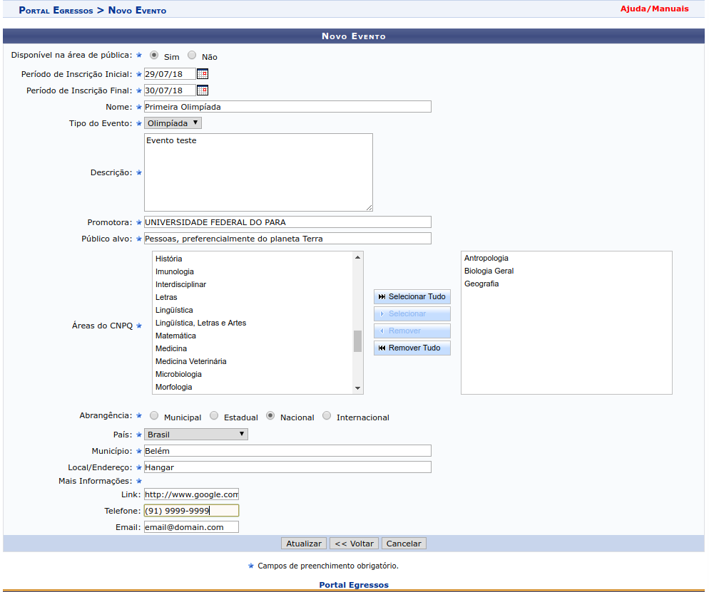
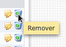

Eventos
=======

Eventos podem ser gerenciados por gestores do portal do egresso e *por membros dos CGIPES*. Após
fazer login no SIGAA e acessar o portal do egresso (como mostrado na seção :ref:`cgipes`), o usuário pode
passar o mouse sobre o menu *Oportunidades* e clicar no submenu *Gerenciar Eventos*, como mostra
a figura a seguir:

O sistema então redireciona para a página de listagem, contendo os eventos e os botões de controle
*Cadastrar*, *Alterar* e *Remover*, como mostra a figura a seguir:

Cadastrar Novo Evento
---------------------

Para cadastrar um novo evento, o usuário deverá clicar inicialmente no botão *Cadastrar*, como
mostra a imagem a seguir:

.. image:: _static/img/cadastrar.png

Em seguida o sistema carrega o formulário de criação de novo evento. Os campos marcados com ``*``
são obrigatórios. Os campos *Periodo de Inscrição (inicial e final)* são do tipo *data*
e os campos *Promotora* e *Município* são do tipo *autocompletar*. Esses dois tipo de campos
foram descritos na seção :ref:`cadastro_novo_membro_cgipes`. O campo *Áreas do CNPQ* foi descrito na seção
:ref:`cadastro_novo_cargo`.

O campo *Disponível na Área Pública* marca o evento a ser cadastrado como público. Esse campo define
se os **detalhes** do mesmo podem ser visualizados na área pública do SIGAA. Para mais detalhes sobre visualização
de oportunidades, acesse a seção :ref:`visualizar_oportunidades`.

O campo *Abrangência* contém as opções relacionadas com a abrangência do evento. Caso seja selecionada opção
*Internacional*, o campo *Município* (que é do tipo *autocompletar*) transforma-se no campo *Município Internacional*
que é do tipo texto. Caso seja selecionada uma opção que não seja *Internacional*, o campo volta a ser
*Município* (que é do tipo *autocompletar*). Esse ajuste no tipo do campo acontece porque o sistema não fornece
opção de autocompletar para municípios internacionais por razões técnicas.

Os campos *link*, *telefone* e *email*, da seção *Mais Informações* não são requeridos entre si,
**mas um deles precisa ser informado**. Caso o usuário deixe os três campos em branco, o sistema exibe uma
mensagem de erro, conforme imagem a seguir:

.. image:: _static/img/form_erro_informacoes.png

Após preencher corretamente todos os campos requeridos, o usuário clicar no botão *Cadastrar* para cadastrar
um novo evento. Se não houverem erros, o sistema salva o novo evento e redireciona para a página de listagem
de eventos descrito anteriormente.

Editar Evento
-------------

Para iniciar o processo de edição, o usuário deve clicar no botão *alterar* da respectivo evento que deve ser editado.

Após o evento ser selecionado, o sistema carrega a página contendo o formulário de novo evento com os campos
preenchidos.

O usuário altera os dados a seu critério e em seguida clicar no botão *Atualizar*. Se os campos
estivem com os formatos corretos, o sistema atualiza o evento e redireciona para a página contendo a listagem de
todos os eventos e ações.

Os botões *voltar* e *cancelar* funcionam de forma idêntica ao do formulário da seção :ref:`cadastrar_novo_cgipes`.

Remover Evento
--------------

Para remover um evento, deve-se clicar no botão *Remover* do respectivo evento na página de listagem.
Uma mensagem de confirmação é exibida ao usuário antes do sistema efetivamente remover o evento.

.. raw:: latex

    \newpage
