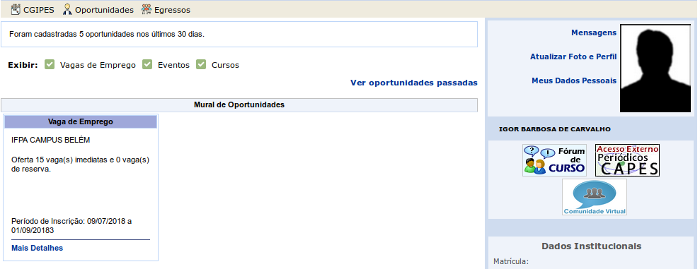
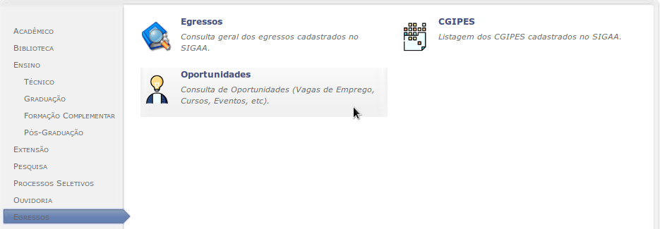
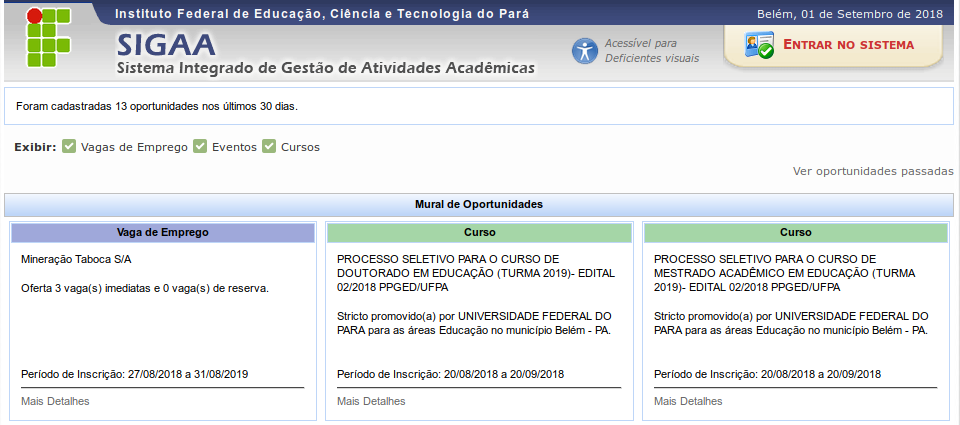
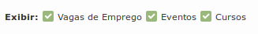
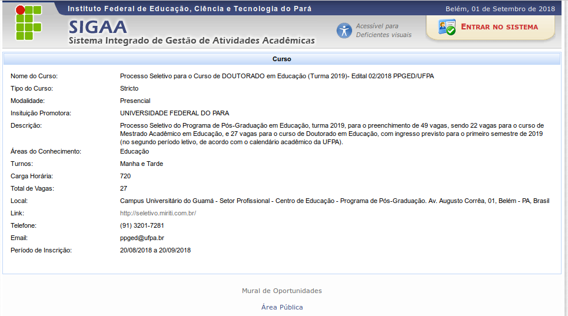
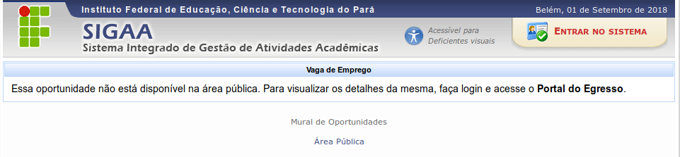

.. _oportunidades:

Oportunidades
=============

O termo *Oportunidades* foi criado para se referir a uma gama de categorias que podem ser gerenciadas por
gestores do portal e posteriormente visualizadas por outros usuários. Essas categorias
podem ser: **Vagas de Emprego**, **Cursos**, **Eventos**, entre
outras.

.. _visualizar_oportunidades:

Visualizar Oportunidades
------------------------

Uma oportunidade pode ser visualizada em dois locais principais.
O primeiro local é o mural de oportunidades do portal do egresso, que é visualizado assim que o usuário *logado* acessa
portal:

O segundo local é a área pública do SIGAA. Para acessar a mural de oportunidades público, primeiramente
o usuário deverá acessar a `área pública do sigaa <https://sigaa.ifpa.edu.br/sigaa/public/>`_.
Em seguida deverá clicar no menu lateral *Egressos* e finalmente no *banner* *Oportunidades*, conforme imagem
a seguir:

O mural de oportunidades públicas, assim como o mural de oportunidades do portal do egresso, permite visualizar
todas as oportunidades que estão disponíveis no sistema. Ao acessar ambos murais, o sistema carrega todas
as oportunidades que estão dentro do período de inscrição. Para visualizar oportunidades fora do periodo de
inscrição, o usuário pode clicar no link *"Ver oportunidades passadas*".

Também é possível filtrar a lista de oportunidades pelo seu tipo, clicando nas caixas de seleção correspondentes.
Esse filtro também está disponível nos dois tipos de murais:

Os murais listam oportunidades em painéis com cabeçalhos em coloração diferente e com informações essenciais
para otimizar a experiência do usuário. Caso o usuário queira visualizar os detalhes de uma dada oportunidade,
ele pode clicar no link *Mais detalhes*. O sistema então para redireciona para a página de detalhes da oportunidade,
como mostra a imagem a seguir:

O mural de oportunidades públicas é idêntico ao mural do portal do egresso para usuário logados, mas com uma
diferença: caso uma oportunidade não tenha sida cadastrada como pública,
*não é possível visualizar detalhes dessa oportunidade na área pública*. O sistema exibe uma mensagem sugerindo
que o usuário faça login e visualize a oportunidade a partir do portal do egresso:

.. raw:: latex

    \newpage
