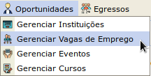
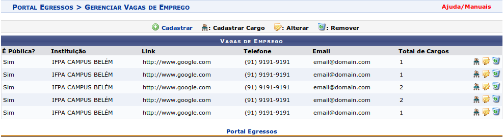
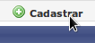
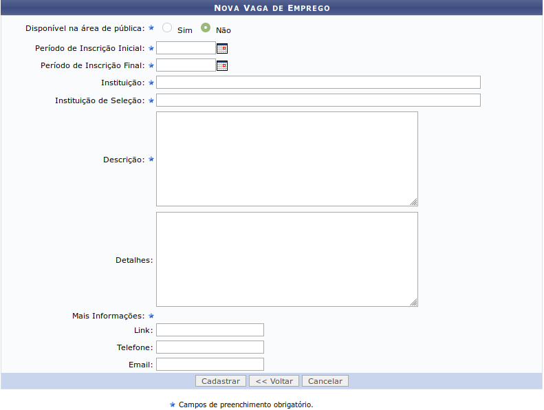
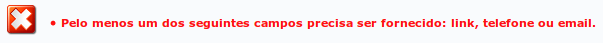

Vagas de Emprego
================

Vagas de emprego podem ser cadastradas por gestores do portal do egresso e *por membros dos CGIPES*. Após
fazer login no SIGAA e acessar o portal do egresso (como mostrado na seção :ref:`cgipes`), o usuário pode
passar o mouse sobre o menu *Oportunidades* e clicar no submenu *Gerenciar Vagas de Emprego*, como mostra
a figura a seguir:

O sistema então redireciona para a página de listagem, contendo as vagas de emprego e os botões de controle
*Cadastrar*, *Cadastrar Cargo*, *Alterar* e *Remover*, como mostra a figura a seguir:

Cadastrar Nova Vaga de Emprego
------------------------------

Para cadastrar uma nova vaga de emprego, o usuário deverá clicar inicialmente no botão *Cadastrar*, como
mostra a imagem a seguir:

Em seguida o sistema carrega o formulário de criação de nova vaga de emprego. Os campos marcados com ``*``
são obrigatórios. Os campos *Periodo de Inscrição (inicial e final)* são do tipo *data*
e os campos *Instituição* e *Instituição de Seleção* são do tipo *autocompletar*. Esses dois tipo de campos
foram descritos na seção :ref:`cadastro_novo_membro_cgipes`.

O campo *Disponível na Área Pública* marca a vaga de emprego a ser cadastrada como pública. Esse campo define
se os **detalhes** da mesma podem ser visualizados na área pública do SIGAA. Para mais detalhes sobre visualização
de oportunidades, acessa a seção :ref:`visualizar_oportunidades`.

Os campos *link*, *telefone* e *email*, da seção *Mais Informações* não são requeridos entre si,
**mas um deles precisa ser informado**. Caso o usuário deixe os três campos em branco, o sistema exibe uma
mensagem de erro, conforme imagem a seguir:

Após preencher corretamente todos os campos requeridos, o usuário clicar no botão *Cadastrar* para cadastrar
uma nova vaga de emprego. Se não houverem erros, o sistema salva a nova vaga de emprego e redireciona
para a página de listagem de vagas descrita anteriormente.
