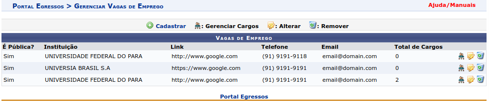
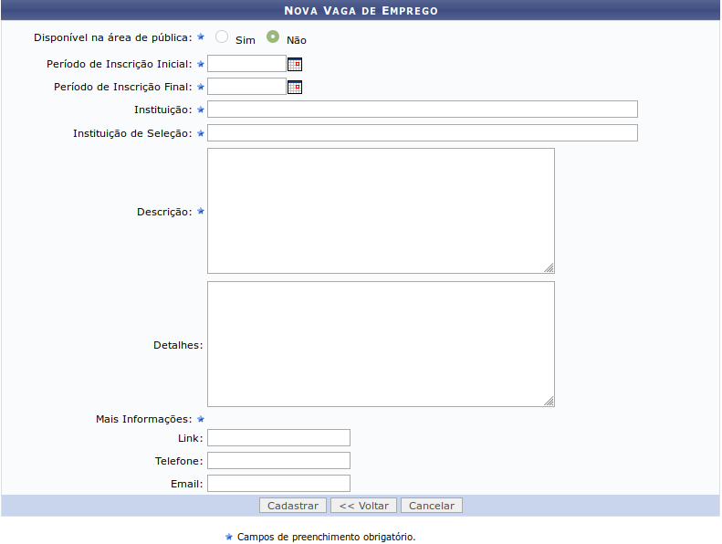
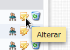
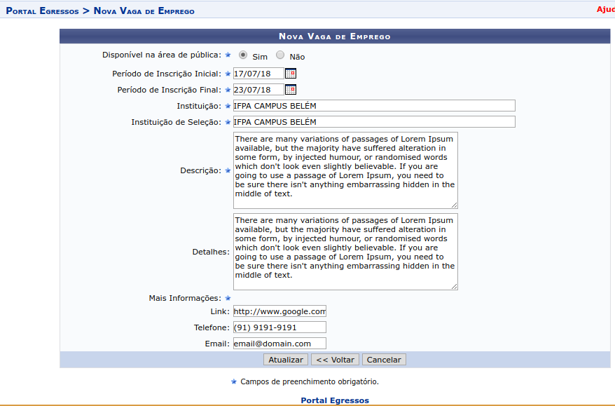
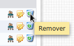
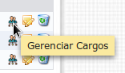
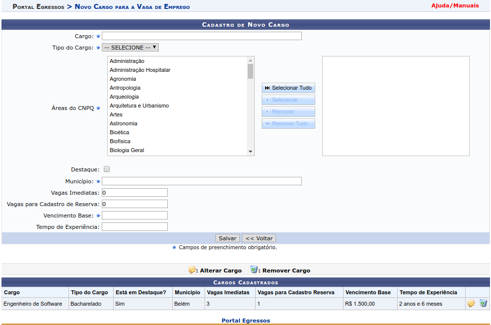
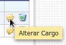
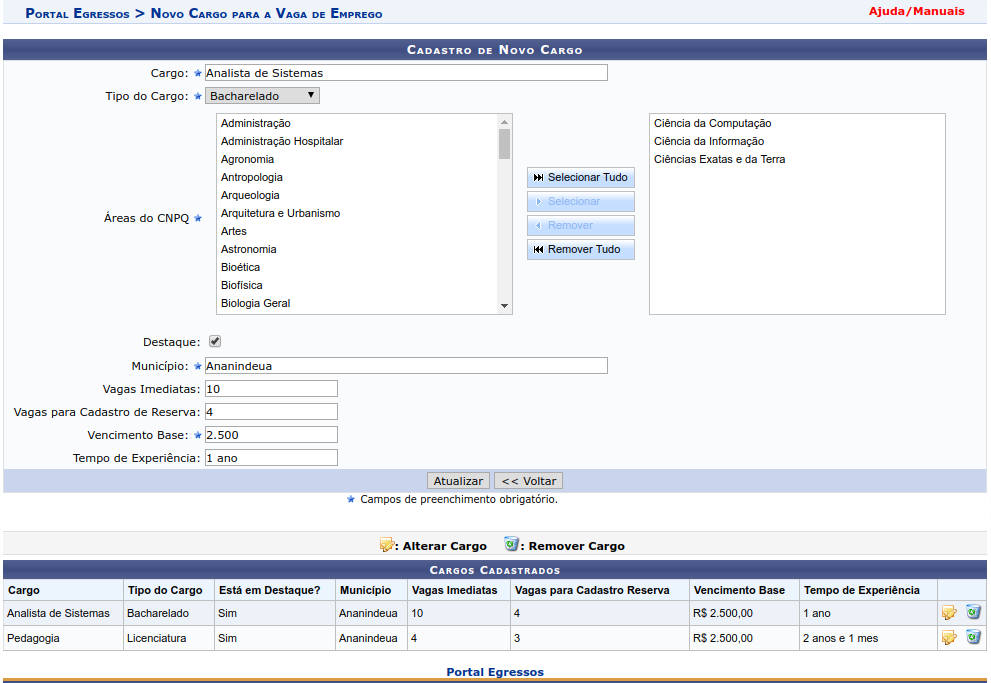
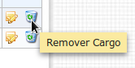

Vagas de Emprego
================

Vagas de emprego podem ser cadastradas por gestores do portal do egresso e *por membros dos CGIPES*. Após
fazer login no SIGAA e acessar o portal do egresso (como mostrado na seção :ref:`cgipes`), o usuário pode
passar o mouse sobre o menu *Oportunidades* e clicar no submenu *Gerenciar Vagas de Emprego*, como mostra
a figura a seguir:

.. image:: _static/img/vagas_emprego/menu_vagas_emprego.png

O sistema então redireciona para a página de listagem, contendo as vagas de emprego e os botões de controle
*Cadastrar*, *Gerenciar Cargos*, *Alterar* e *Remover*, como mostra a figura a seguir:

Cadastrar Nova Vaga de Emprego
------------------------------

Para cadastrar uma nova vaga de emprego, o usuário deverá clicar inicialmente no botão *Cadastrar*, como
mostra a imagem a seguir:

.. image:: _static/img/cadastrar.png

Em seguida o sistema carrega o formulário de criação de nova vaga de emprego. Os campos marcados com ``*``
são obrigatórios. Os campos *Periodo de Inscrição (inicial e final)* são do tipo *data*
e os campos *Instituição* e *Instituição de Seleção* são do tipo *autocompletar*. Esses dois tipo de campos
foram descritos na seção :ref:`cadastro_novo_membro_cgipes`.

O campo *Disponível na Área Pública* marca a vaga de emprego a ser cadastrada como pública. Esse campo define
se os **detalhes** da mesma podem ser visualizados na área pública do SIGAA. Para mais detalhes sobre visualização
de oportunidades, acesse a seção :ref:`visualizar_oportunidades`.

Os campos *link*, *telefone* e *email*, da seção *Mais Informações* não são requeridos entre si,
**mas um deles precisa ser informado**. Caso o usuário deixe os três campos em branco, o sistema exibe uma
mensagem de erro, conforme imagem a seguir:

.. image:: _static/img/form_erro_informacoes.png

Após preencher corretamente todos os campos requeridos, o usuário clicar no botão *Cadastrar* para cadastrar
uma nova vaga de emprego. Se não houverem erros, o sistema salva a nova vaga de emprego e redireciona
para a página de listagem de vagas descrita anteriormente.

Editar Vaga de Emprego
----------------------

Para iniciar o processo de edição, o usuário deve clicar no botão *alterar* da respectiva vaga de emprego que deve ser editada.

Após a vaga de emprego ser selecionada, o sistema carrega a página contendo o formulário de nova vaga de emprego com os campos
preenchidos. O usuário altera os dados a seu critério e em seguida clicar no botão *Atualizar*. Se os campos
estivem com os formatos corretos, o sistema atualiza a vaga de emprego e redireciona para a página contendo a listagem de
todas a vagas de emprego e ações.
Os botões *voltar* e *cancelar* funcionam de forma idêntica ao do formulário da seção :ref:`cadastrar_novo_cgipes`.

Remover Vaga de Emprego
-----------------------

Para remover uma vaga de emprego, deve-se clicar no botão *Remover* da respectiva vaga de emprego na página de listagem.
Uma mensagem de confirmação é exibida ao usuário antes do sistema efetivamente remover a vaga de emprego. Uma vaga de emprego não pode
ser removida se possuir cargos cadastrados.

Gerenciamento de cargos
-----------------------

Para acessar a página de gerenciamento de cargos, basta clicar no botão *Gerenciar Cargos* da respectiva vaga de emprego.

A página consiste em duas seções, uma contendo o formulário de inclusão de um novo cargo para uma determinada vaga de emprego
e outra, abaixo, contendo a listagem de cargos para aquela vaga de emprego:

.. _cadastro_novo_cargo:

Cadastro de Novo Cargo
**********************

Todos os campos marcados com ``*`` são obrigatórios. O campo *município* é do tipo *autocompletar*, como descrito na
seção :ref:`cadastro_novo_membro_cgipes`.

O campo *Áreas do CNPQ* é formado por 3 seções. Uma listagem de áreas do CNPQ do lado esquerdo, uma lista de botões de ação
no centro e uma lista de áreas do CNPQ do lado direito. **Os items selecionados para o campo são os items que estão
marcados do lado direito**.

Para **selecionar** um item, primeiramente o usuário clica no
item do lado esquerdo para marcá-lo (para selecionar múltiplos items, o usuário precisa clicar nos mesmos
**mantendo a tecla CTRL pressionada**). Em seguida o usuário clica no botão de ação *Selecionar* para mover os items marcados
do lado esquerdo para o lado direito. Caso o usuário queira selecionar **todos** os items do lado esquerdo, basta
clicar no botão de ação *Selecionar Tudo*.

Para **deselecionar** um item, primeiramente o usuário clica no
item do lado direito para marcá-lo (para selecionar múltiplos items, o usuário precisa clicar nos mesmos
**mantendo a tecla CTRL pressionada**). Em seguida o usuário clica no botão de ação *Remover* para mover os items marcados
do lado direito para o lado esquerdo. Caso o usuário queira deselecionar **todos** os items do lado direito, basta
clicar no botão de ação *Remover Tudo*.

Ao clicar no botão *Voltar*, o sistema redireciona para a página de listagem de vagas de emprego.

Após a inserção dos dados corretamente, o usuário clica no botão *Salvar* e um novo cargo é incluído na listagem
de cargos daquela vaga de emprego.

Editar Cargo
************

Para editar um cargo, o usuário clica no botão *Alterar Cargo*, do respectivo cargo que se quer editar, a partir
da seção que contém a listagem de cargos para aquela vaga de emprego.

O sistema então carrega o formulário de cadastro preenchido com os dados do cargo que acabou
de ser selecionado. O usuário então pode editar os campos do formulário seguindo as mesmas recomendações descritas na seção
`Cadastro de Novo Cargo`_.

Após alterar os dados do cargo, o usuário clica no botão *Atualizar*. Se os dados inseridos
estiverem com os formatos corretos, o sistema atualiza o cargo e atualiza a listagem de cargos daquela vaga de emprgo (agora
contendo os dados atualizados do cargo que acabou de ser editado).

Remover Cargo
*************

Para remover um cargo, o usuário clica no botão *Remover Cargo* do respectivo cargo que se quer remover, a
partir da listagem de cargos.

O sistema exibe uma mensagem de confirmação antes de remover o cargo daquela vaga de emprego.

.. raw:: latex

    \newpage
